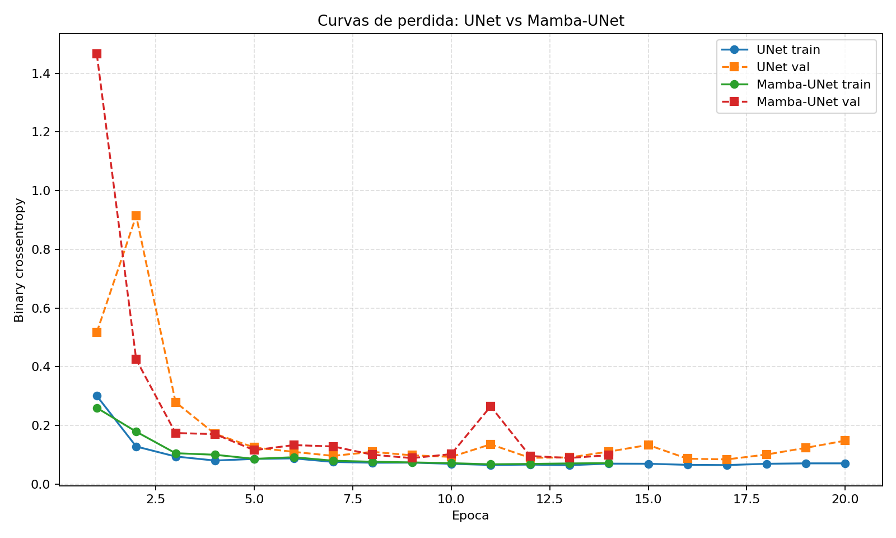
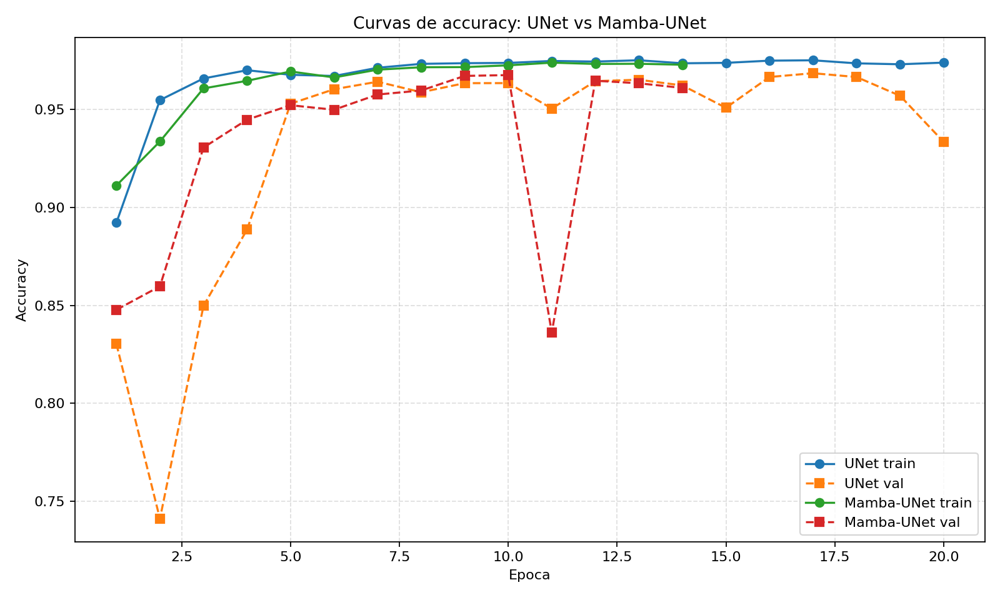
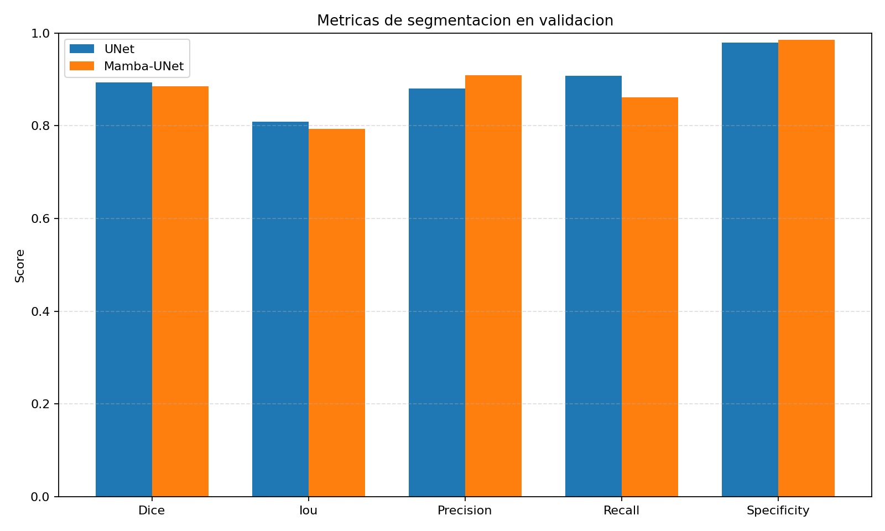

# SEGMENTACION DE CELULAS

Comparando 2 tipos de arquitecturas para la segmentacion de celulas:
1. ** Arquitectura U-Net**
2. **Arquitectura Mamba**


Primero se realizo una investigacion sobre el dataset, obtiendo 670 imgenes con su respectiva mascara
para comenzar, primero se construyo un dataset fusionado en la carpeta dataset_fusionado/.

El archivo utils/dataset.py se encarga de cargar el dataset y combinar las mascaras en una sola
que posteriormente se ocupara para el entrenamiento de los modelos.


el dataset https://bbbc.broadinstitute.org/BBBC038

## Entrenamiento U-Net

El entrenamiento usa `src/train_unet.py` sobre el dataset fusionado en `dataset_fusionado/images` y `dataset_fusionado/masks`. El script valida los pares imagen/mascara, entrena con `tf.data` y guarda el modelo junto con las metricas en el directorio indicado con `--output-dir`.

### Preparar entorno

Activar la `.venv` del repo:

```bash
source .venv/bin/activate
```

Instalar dependencias minimas si el entorno no las tiene:

```bash
python -m pip install tensorflow pillow matplotlib
```

En este entorno ya estaba disponible TensorFlow 2.21.0 con Keras 3.14.1, NumPy 2.4.6, Pillow 12.2.0 y Matplotlib 3.10.9.

### Verificar dataset sin entrenar

```bash
python src/train_unet.py --dry-run
```

Resultado obtenido: 670 pares imagen/mascara detectados y estimacion de 0.65 GiB si se cargaran como arreglos NumPy.

### Smoke train

Corrida minima para verificar que TensorFlow, el modelo, el dataset y el guardado funcionan:

```bash
python src/train_unet.py --device cpu --epochs 1 --batch-size 1 --filters 4 --steps-per-epoch 1 --validation-steps 1 --output-dir outputs/unet-smoke
```

Resultado obtenido: 3.90 segundos, `accuracy=0.8617`, `loss=0.6637`, `val_accuracy=0.8761`, `val_loss=0.6867`. Artefactos guardados en `outputs/unet-smoke/`.

### Entrenamiento acotado usado en este entorno

Como TensorFlow no pudo usar CUDA/GPU en esta maquina, se ejecuto una corrida CPU acotada para evitar saturar el equipo:

```bash
python src/train_unet.py --device cpu --epochs 5 --batch-size 2 --filters 8 --steps-per-epoch 20 --validation-steps 5 --output-dir outputs/unet-cpu-safe
```

Resultado obtenido: 10.10 segundos, 670 pares totales, 536 de entrenamiento y 134 de validacion. Metricas finales: `accuracy=0.9192`, `loss=0.2181`, `val_accuracy=0.5420`, `val_loss=0.9965`. Artefactos guardados en `outputs/unet-cpu-safe/`:

```text
outputs/unet-cpu-safe/model.keras
outputs/unet-cpu-safe/history.json
outputs/unet-cpu-safe/metrics.json
```

## Comparacion actual: U-Net vs Mamba-UNet

Conclusion: en esta corrida completa, **U-Net gano en Dice e IoU**, que son las metricas mas importantes para segmentacion binaria de mascaras. El hibrido **Mamba-UNet gano en `val_accuracy`, `val_loss`, precision y specificity**, pero con menor Dice/IoU y mas parametros.

La comparacion se ejecuto con el mismo dataset fusionado, 670 pares imagen/mascara, split fijo de 536 entrenamiento y 134 validacion, batch 4, 20 epocas configuradas y 32 filtros base. TensorFlow detecto la GPU RTX 2050 con `--device auto`; durante el entrenamiento aparecieron avisos de memoria GPU, pero ambas corridas terminaron y guardaron metricas/modelos.

### Comandos ejecutados

```bash
.venv/bin/python src/train_unet.py --model unet --device auto --epochs 20 --batch-size 4 --filters 32 --output-dir outputs/unet-full
.venv/bin/python src/train_unet.py --model mamba --device auto --epochs 20 --batch-size 4 --filters 32 --output-dir outputs/mamba-full
```

### Resultados finales

| Modelo | Epocas reales | Parametros | Tiempo | Val accuracy | Val loss | Dice | IoU | Precision | Recall | Specificity |
|---|---:|---:|---:|---:|---:|---:|---:|---:|---:|---:|
| U-Net | 20 | 8,634,465 | 632.94 s | 0.9334 | 0.1481 | **0.8940** | **0.8084** | 0.8808 | **0.9076** | 0.9789 |
| Mamba-UNet | 14 | 9,429,601 | 575.51 s | **0.9609** | **0.0988** | 0.8846 | 0.7932 | **0.9096** | 0.8610 | **0.9853** |

Mamba-UNet quedo en 14 epocas reales porque `EarlyStopping` corto antes de la epoca 20 al no mejorar `val_loss`. Eso no invalida la comparacion: ambos modelos tuvieron el mismo maximo de epocas y el mismo criterio de parada.

### Graficas generadas







Tambien quedan disponibles las curvas individuales generadas por el script:

| Modelo | Curvas individuales | Metricas |
|---|---|---|
| U-Net | `outputs/unet-full/learning_curves.png` | `outputs/unet-full/metrics.json` |
| Mamba-UNet | `outputs/mamba-full/learning_curves.png` | `outputs/mamba-full/metrics.json` |

### Cuando conviene U-Net

Conviene usar **U-Net** cuando el objetivo principal es maximizar solapamiento de mascara: Dice e IoU. En esta corrida U-Net segmento mejor a nivel de area real, tuvo menos parametros y mejor recall, asi que es la opcion mas fuerte si se busca no perder celulas u objetos positivos.

### Cuando conviene Mamba-UNet

Conviene probar **Mamba-UNet** cuando se prioriza reducir falsos positivos o capturar contexto global con una variante mas expresiva. En esta corrida tuvo mejor precision, specificity, `val_accuracy` y `val_loss`, pero no supero a U-Net en Dice/IoU. Para elegirlo como modelo final haria falta validar si esa mayor precision compensa perder recall y solapamiento.

### Caveat tecnico

La accuracy de pixeles puede ser enganosa en segmentacion porque suele estar dominada por el fondo. Por eso la decision principal se debe apoyar en Dice e IoU, no solo en accuracy.
